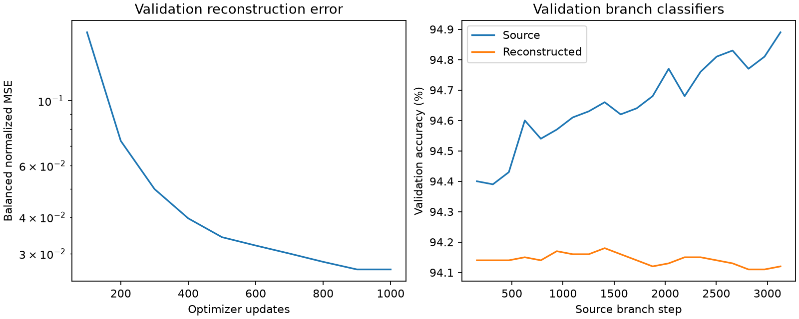

# Parameter autoencoder pilot results

Completed October 6, 2026 under authorization to continue to a git commit milestone.
The 128-dimensional attempt passed the reconstruction accuracy gate; no 256-dimensional
retry was run. No diffusion training or official test evaluation occurred.

## Architecture and training

Deterministic four-block 1D convolutional autoencoder, channels 8/16/32/32, kernel 8,
stride 4, padding 2, LeakyReLU activations, and a linear 128-dimensional bottleneck.
The decoder reverses the channel/length progression. Vector length 25,818 is padded
with zeros to 26,112; encoded length is 102 and flattened feature size 3,264. Decoder
output is cropped to 25,818 before loss computation. Each of the six tensor blocks
contributes equally to normalized reconstruction MSE. No augmentation or stochastic
latent sampling is used. Stride four is a CPU-budget implementation choice rather
than an exact reproduction of the authors' autoencoder.

Seed 42, Adam 0.001, batch size 16, 1,000 optimizer updates, validation loss every
100 updates. Training used only 160 training vectors. A separate preparation command
exported 180 training/validation inputs; the trainer refuses artifacts containing
held-out records. The validation-loss-selected checkpoint is update 900, not the
last update or a classifier-accuracy-selected checkpoint.

## Results

| Metric | Result |
| --- | --- |
| Median source validation accuracy | 94.65% |
| Median reconstructed validation accuracy | 94.14% |
| Difference of median accuracies | 0.51 percentage points |
| Per-checkpoint accuracy loss range | 0.25–0.77 percentage points |
| Balanced normalized validation MSE | 0.02650825 |
| Training, validation, plotting time | 52.06 seconds |
| Process peak resident memory | 606.62 MB |
| Exported latent shape | 180 × 128 (160 training, 20 validation) |

All twenty validation-branch classifiers were restored into fresh models and evaluated
without gradient updates. Their original accuracies matched saved provenance. The
one-percentage-point median accuracy-loss gate passed. Source/held-out behavior is
still not final test evidence.



Normalized reconstruction MSE by tensor block:

| Block | MSE |
| --- | --- |
| First-layer weight | 0.14740507 |
| First-layer bias | 0.00212517 |
| Second-layer weight | 0.00584749 |
| Second-layer bias | 0.00159180 |
| Output weight | 0.00166289 |
| Output bias | 0.00041706 |

The first-layer weight matrix accounts for most residual error. Reconstructions also
compress source variation: the RMS of per-coordinate normalized standard deviations
across validation vectors falls from 0.03062 to 0.00783 after reconstruction. The nearly
flat reconstructed-accuracy curve reinforces this limitation. Passing reconstruction
does not establish preserved diversity or that diffusion is necessary. Later comparison
with a central latent and a simple Gaussian is essential.

Latents were exported twice with identical results. Coordinate means and standard
deviations were fitted on the 160 training rows only, with a 1e-6 standard-deviation
floor. Standardization/inverse checks pass. The frozen autoencoder includes exact
architecture shapes, parameter manifest/normalization, source and input SHA256 identities,
training settings, best step, and gate status. Latent exports record its SHA256 identity.

Committed evidence: [classifier CSV](results/04_Reconstruction.csv) and
[attempt summary](results/04_Autoencoder.json). Binary artifacts remain local and ignored:
`artifacts/autoencoder-pilot/128/best.pt`, `history.json`, `results.json`,
`reconstruction.csv`, `reconstruction.png`, and `artifacts/autoencoder-pilot/latents.pt`.

Reproduce with fresh output paths:

```sh
python -m p_diff.prepare_reconstruction
python -m p_diff.train_autoencoder
python -m p_diff.export_latents --checkpoint artifacts/autoencoder-pilot/128/best.pt
python -m pytest -q
```

## Reference and reuse record

Inspected [the authors' autoencoder](https://github.com/NUS-HPC-AI-Lab/Neural-Network-Diffusion/blob/0ecca89fe6cdf4faaecad7d563c5e70d7c2a3d36/model/pdiff.py):
it uses strided 1D convolutions, normalization, latent projections, transposed convolutions,
and optional variational sampling. Our deterministic implementation uses a different
stride, no batch normalization, explicit cropping, and balanced tensor-block loss.
Also inspected [their small MNIST checkpoint preparation](https://github.com/NUS-HPC-AI-Lab/Neural-Network-Diffusion/blob/0ecca89fe6cdf4faaecad7d563c5e70d7c2a3d36/dataset/full/mnist_cnnmedium/finetune.py),
which loads a pretrained network and saves fine-tuning snapshots. Our protocol uses
separate validation images and reserved branch assignments.

Repository tree revision: `0ecca89fe6cdf4faaecad7d563c5e70d7c2a3d36`. Its inspected
tree contained no file with a license filename. No upstream code was copied or vendored;
future reuse requires resolving upstream licensing. This remains a p-diff-inspired
prototype, not an exact reproduction.

Next: [bounded latent diffusion pilot](05_Diffusion_Pilot.md), requiring its own approval.
