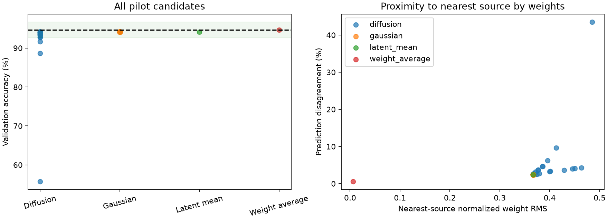

# Latent diffusion pilot results

Completed October 6, 2026 under phase 5 authorization. The 2,000-update pilot and
all planned comparisons completed within the 30-minute cap. Generation works without
classifier fine-tuning, but this experiment shows no advantage over simpler baselines.

## Fixed protocol

Training used only the 160 standardized training latents. The autoencoder stayed
frozen. The residual MLP has 128 inputs/outputs, a 64-dimensional sinusoidal timestep
embedding, width 256, and three residual blocks. Adam learning rate 0.001, batch size
32, seed 42, CPU with one thread. DDPM uses 200 zero-indexed steps, linear betas
0.0005–0.1, epsilon-prediction MSE, posterior variance, and no clipping of latent
coordinates. Schedule coefficients are calculated in float64 and stored in float32;
terminal cumulative alpha is 0.0000303184, making the forward terminal distribution
approximately Gaussian noise. This schedule was fixed before training.

Checkpoint selection used median validation accuracy for five fixed seeds 10001–10005,
evaluated every 500 updates. Update 2,000 was selected; ties would select the earlier
checkpoint. Final stochastic comparisons each used twenty fresh seeds 20001–20020,
with highest validation accuracy and lowest seed on ties selecting a candidate. These
fresh generation seeds still use the same validation images; results remain exploratory.

## All-candidate comparison

Training-source median validation accuracy is 94.67%. The lower two-point threshold
is 92.67%. All comparisons use the fixed 10,000 validation images.

| Method | Count | Mean | Median | Std. dev. | Worst | Within two points |
| --- | --- | --- | --- | --- | --- | --- |
| Diffusion | 20 | 91.3985% | 93.545% | 8.2686 pp | 55.75% | 85% |
| Diagonal latent Gaussian | 20 | 94.153% | 94.15% | 0.0193 pp | 94.11% | 100% |
| Decoded training latent mean | 1 | 94.15% | 94.15% | — | 94.15% | 100% |
| Average training source weights | 1 | 94.67% | 94.67% | — | 94.67% | 100% |

Diffusion passes the prespecified pilot quality target: its median is within two
percentage points of the source median, and at least 80% of candidates fall within
that interval. However, its mean and worst-case accuracy expose an unreliable tail.
Three candidates fall outside the interval. All candidates produced finite, loadable
classifiers, so zero technical failures does not mean zero poor classifiers.

Validation-selected diffusion candidate: seed 20014, accuracy 94.18%. Selected Gaussian
candidate: seed 20005, accuracy 94.19%. Neither beats the 94.67% weight average. These
are validation-selected results, not deployment or official test results.



## Proximity and diversity

Distances are full-vector normalized weight RMS to the nearest of 160 training sources.
Disagreement compares validation predictions with that nearest source by weights.
Neither distance nor disagreement proves a lack of memorization or useful novelty.

| Method | Mean nearest-source RMS | Mean disagreement with nearest weight source |
| --- | --- | --- |
| Diffusion | 0.40008 | 5.8675% |
| Gaussian | 0.36685 | 2.4160% |
| Latent mean | 0.36683 | 2.4200% |
| Weight average | 0.00624 | 0.6000% |

Mean pairwise prediction disagreement among candidates is 7.7896% for diffusion and
0.1555% for Gaussian. Diffusion's larger disagreement includes its poor classifiers;
it is not evidence of desirable diversity. Gaussian and central-latent results are
very similar, consistent with reconstruction having reduced source variation.

## Timing and artifacts

Training, image preparation, and four checkpoint-selection evaluations: 5.51 seconds.
Training plus source-reference evaluation and final sampling/comparison: 7.75 seconds,
before plot rendering. Process peak resident memory: 607.90 MB. Mean sampling/decoding
time per diffusion classifier: 40.38 ms; Gaussian: 0.57 ms. Mean validation/proximity
evaluation per candidate: roughly 11–12 ms. Bundle loading, file writes, and selection
costs are not included in per-model sampling time; total pipeline timing includes them.
An independent CLI invocation including bundle loading took 83 ms.

One-time earlier source training, source collection, and autoencoder costs remain
necessary. These timings do not demonstrate an end-to-end cost advantage over ordinary
classifier training at matching accuracy.

`artifacts/diffusion-pilot/` (local, ignored by git) contains the 4.12 MB standalone
`generator.pt`, forty-two complete classifiers in `models/`, `run.json`, selection
history, all-candidate CSV, comparison plot, and summary metrics; about 8.72 MB total.
The bundle contains only denoiser/decoder state, diffusion configuration, architecture
manifest, parameter/latent statistics, and provenance. It contains no source vectors,
latent dataset, or encoder weights. Generated classifiers load into the fixed MLP
without optimizer state or gradient updates.

Committed report evidence:
- [All candidates](results/05_Candidates.csv)
- [Summary](results/05_Diffusion.json)
- [Training and selection history](results/05_Diffusion_History.json)

Verification: all fourteen tests pass, including forward/reverse posterior formulas,
the deterministic final reverse step, local seed reproducibility, decoder-only
equivalence, split exclusion, and failure-aware metrics. All forty-two saved classifiers
passed tensor reload checks. Standalone generation from a different working directory
exactly reproduced diffusion candidate 20001 without dataset access. The standalone
evaluator reproduced selected candidate 20014's 94.18% validation accuracy. Neither
held-out branch behavior nor official test images were evaluated.

Reproduce from the existing upstream artifacts with a fresh pilot output directory:

```sh
python -m p_diff.train_diffusion
python -m p_diff.generate_models --seed 30001 --output artifacts/generated-classifier.pt
python -m p_diff.evaluate --model artifacts/diffusion-pilot/models/diffusion-20014.pt
python -m pytest -q
```

DDPM math was checked against the [original paper](https://arxiv.org/abs/2006.11239)
and [the authors' reference implementation](https://github.com/hojonathanho/diffusion/blob/master/diffusion_tf/diffusion_utils.py).
The implementation here is independently written; no upstream code was copied.

Next: [locked evaluation plan](06_Locked_Evaluation.md). Keep the weak-tail result,
compare all baselines, and do not extend training based on future test accuracy.
