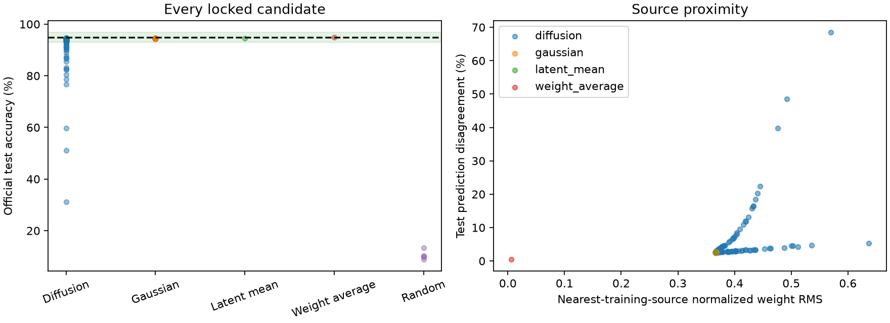
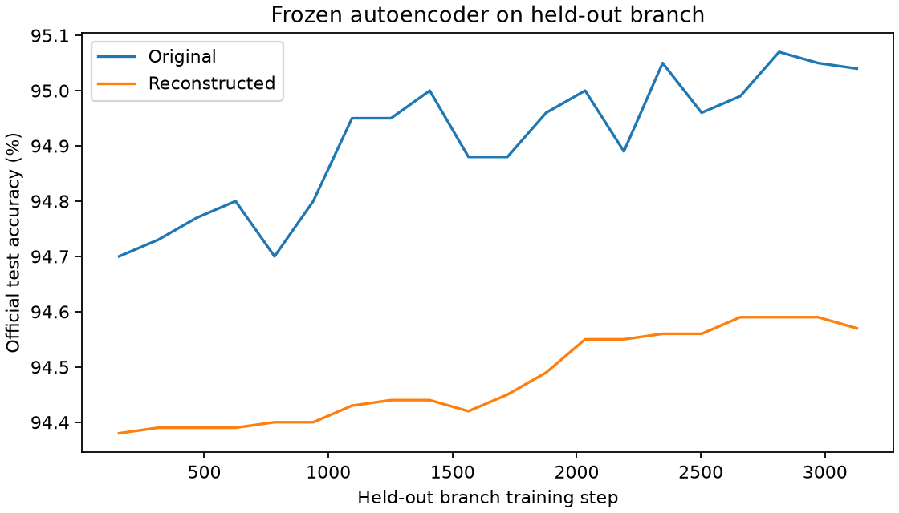

# Locked single-seed evaluation results

Completed October 10, 2026 under phase 6 authorization. All prescribed candidates,
source checkpoints, and held-out reconstructions were evaluated without training,
fine-tuning, or hyperparameter changes. This completes the first prototype with a
valid negative result: diffusion missed the reliability target and did not improve
over simple baselines.

## Protocol and selection

The protocol was saved before official test access and bound the generator, source
dataset, autoencoder, latent artifact, image split, normalization statistics, runtime,
evaluation code, seeds, counts, metric definitions, and selection rule by hashes.
Protocol SHA256: `f106565527046202ebdd1f652050dc01217690a497d173647069bbfa3becf17f`.

Diffusion and Gaussian each used seeds 40001–40100; five random classifiers used
50001–50005. Every model was evaluated on the fixed validation images first. The
highest validation accuracy selected each stochastic method's candidate, with lowest
seed breaking ties. The selections were saved and their model hashes checked before
constructing the official test dataset. Their sealed hashes were recorded in the
test-access marker. Hash checks still pass after evaluation.

## Official test results

The reference is the median test accuracy of the 160 training-source checkpoints:
**94.93%**. Being within two percentage points means 92.93–96.93% test accuracy.
The prespecified target requires both a generated median inside that interval and
at least 80% of samples inside it.

| Method | Count | Mean test accuracy | Median | Std. dev. | Worst | Within two points |
| --- | --- | --- | --- | --- | --- | --- |
| Diffusion | 100 | 91.3092% | 94.08% | 8.7622 pp | 31.24% | 77% |
| Diagonal latent Gaussian | 100 | 94.4665% | 94.47% | 0.0396 pp | 94.38% | 100% |
| Decoded training latent mean | 1 | 94.44% | 94.44% | — | 94.44% | 100% |
| Average training source weights | 1 | 94.96% | 94.96% | — | 94.96% | 100% |
| Random initialization | 5 | 10.464% | 10.11% | 1.5247 pp | 8.78% | 0% |

Diffusion's median passes the two-point condition, but **77/100 falls short of 80/100**;
23 samples lie outside the interval. All 207 candidates produced usable classifiers,
so this is a quality failure rather than a serialization or numerical failure.
The twenty-sample exploratory pilot had passed its 85% fraction; the larger locked
sample set exposed the weaker reliability. No training was extended after observing it.

| Validation-selected candidate | Seed | Selection validation accuracy | Official test accuracy |
| --- | --- | --- | --- |
| Diffusion | 40088 | 94.18% | 94.57% |
| Gaussian | 40011 | 94.21% | 94.50% |

The selected diffusion model slightly exceeds the selected Gaussian model on test
accuracy, but this does not overturn the full-distribution result. Its selection used
validation only. The best observed diffusion test sample (94.60%) was not used to choose
the deployment candidate. Averaged source weights remain the strongest baseline here.



## Source and held-out evidence

| Source branch split | Count | Mean test accuracy | Median | Range |
| --- | --- | --- | --- | --- |
| Training | 160 | 94.9194% | 94.93% | 94.65–95.13% |
| Validation | 20 | 94.9275% | 94.92% | 94.73–95.11% |
| Held-out | 20 | 94.9085% | 94.95% | 94.70–95.07% |

Frozen autoencoder reconstructions of the twenty held-out checkpoints had median
test accuracy **94.445%**, versus **94.95%** before reconstruction: a 0.505-point loss.
Per-checkpoint loss ranged from 0.30 to 0.56 points. This supports reconstruction within
the shared-base family; all branches still share one trained initialization.



## Proximity and collapse limits

| Group | Mean nearest-training-source normalized RMS | Mean test disagreement with nearest weight source |
| --- | --- | --- |
| Training sources, excluding themselves | 0.00846 | 0.5456% |
| Validation sources | 0.01019 | 0.4735% |
| Held-out sources | 0.01023 | 0.4810% |
| Diffusion candidates | 0.40457 | 6.3054% |
| Gaussian candidates | 0.36685 | 2.5768% |
| Latent mean | 0.36683 | 2.5700% |
| Weight average | 0.00624 | 0.3900% |

Candidate-to-candidate test prediction disagreement averaged 8.1704% for diffusion
and 0.1680% for Gaussian. Diffusion's poor tail contributes to its larger disagreement;
this is not evidence of useful diversity. Similar Gaussian and mean-latent accuracy,
together with low Gaussian disagreement, indicate a narrow decoded distribution.
Distances and disagreements do not prove a lack of memorization. Snapshots and pair
comparisons are correlated, and only one base-model seed was tested.

## Costs and deliverables

The locked evaluation took **12.45 seconds** including plots, CPU with one thread,
and peak process resident memory was **550.45 MB**. Bundle loading took 8.24 ms.
Generation/export/validation/selection stage: 6.31 seconds. Official test data loading:
0.28 seconds; all source test/proximity checks: 2.28 seconds; candidate test/proximity
checks: 2.74 seconds; held-out reconstruction checks: 0.13 seconds. These stages are
reported separately; validation-stage timing already includes bundle loading.

| Per-candidate mean | Diffusion | Gaussian |
| --- | --- | --- |
| Generation and restoration | 44.03 ms | 0.83 ms |
| File export | 0.68 ms | 0.54 ms |
| Validation evaluation | 5.00 ms | 4.88 ms |
| Final test plus source proximity | 10.86 ms | 10.49 ms |

Candidate selection requires the whole validation candidate set, not just one sampling
call. Earlier one-time stages remain necessary: seed-42 baseline 8.55 seconds, full
source collection 146.92 seconds, autoencoder pilot 52.06 seconds, and diffusion pilot
7.75 seconds. Those pilot stage timings include their evaluations and some reporting;
they are not pure optimizer times. We did not run a controlled matching-accuracy
training-cost comparison, so no end-to-end cost advantage is established.

Saved generator: `artifacts/diffusion-pilot/generator.pt`. Its decoder-only bundle
generates classifiers without loading MNIST, encoder weights, or source checkpoints.
Final candidate models and evaluation artifacts are in `artifacts/locked-evaluation/`.
The fixed validation choices can be loaded through `selections.json`; all candidate
files remain available, including low-accuracy diffusion outputs.

Committed evidence:
- [Frozen protocol](results/06_Protocol.json), [sealed selections](results/06_Selections.json),
  [test-access marker](results/06_Test_Access.json), and [completion record](results/06_Completion.json).
- [All candidate metrics](results/06_Candidates.csv), [pre-test validation metrics](results/06_Validation_Candidates.csv),
  [all source metrics](results/06_Sources.csv), and [held-out reconstruction metrics](results/06_Held_Out_Reconstruction.csv).
- [Full summary](results/06_Evaluation.json), the plots above, and
  [loading/prediction notebook](../notebooks/generated_classifier.ipynb).

Nineteen tests passed before protocol locking, covering hash tampering, exclusive
locks, count/seed completeness, pre-test selections, dataset-access order, and exclusion
of source self-comparisons, alongside previous math and codec checks. After evaluation,
all locked hashes, 207 saved classifiers, 200 source rows, twenty reconstructions,
selection identities, and result hashes were verified. All notebook code cells executed
successfully using the project environment; it performs prediction without updates.

Reproduce the same frozen evaluation from the project root, using existing source
and generator artifacts and a fresh output directory:

```sh
python -m p_diff.locked_evaluation --protocol plans/results/06_Protocol.json --output artifacts/locked-evaluation-repeat
```

The committed protocol rejects changes to its evaluation code or upstream artifacts.
Creating a new protocol is a new recorded run, not a replacement of the original lock.
Official test data has now been used; later model revisions must disclose reuse and
must not be represented as an untouched-test experiment.

Next, if authorized: [validation-only instability diagnosis](07_Instability_Diagnosis.md).
Keep this frozen negative result and the simple baselines intact.
