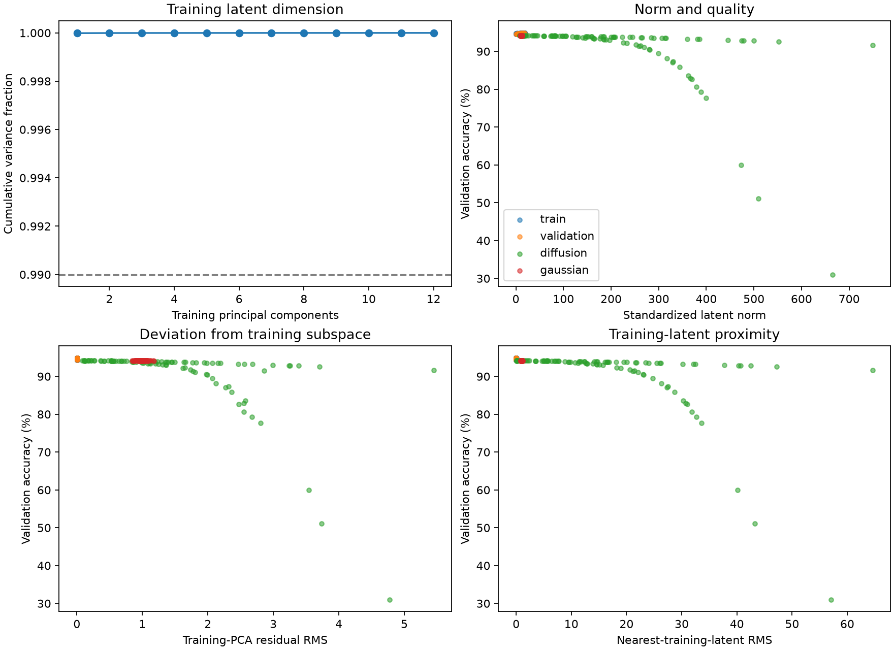
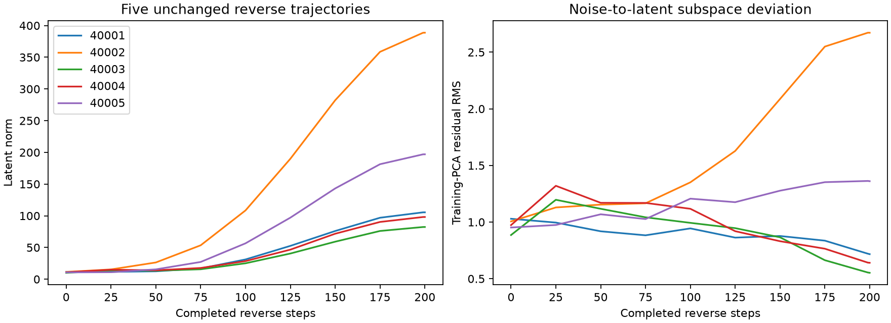

# Frozen latent instability diagnosis

Completed October 10, 2026 under phase 7 authorization. No model updates, sampling
changes, rejection, clipping, new candidate selection, dataset loading, official
test evaluation, or held-out branch behavior was used. The frozen phase 6 result
remains unchanged.

Training-only PCA was fitted to the 160 standardized training codes. A 99% retained
variance rule selected **one component**, which explains **99.9987508%** of their
variation. The twenty validation codes were used only for diagnostics, not PCA fitting.
The compressed distribution is nearly a line in a 128-coordinate space; this is
evidence of low effective latent dimension, not 128 independent directions.

## Frozen samples and validation observations

The existing diffusion and Gaussian seeds 40001–40100 were regenerated unchanged.
Behavioral scores came exclusively from the validation CSV written before official
test access. The command refuses a CSV containing test accuracy. Source nearest-latent
distances exclude self-comparisons for training rows.

| Group | Count | Median latent norm | Maximum norm | Median PCA residual RMS | Median nearest-training-latent RMS |
| --- | --- | --- | --- | --- | --- |
| Training codes | 160 | 9.82 | 19.45 | 0.00321 | 0.00551 |
| Validation codes | 20 | 9.86 | 18.80 | 0.00311 | 0.00646 |
| Diffusion samples | 100 | 184.30 | 749.69 | 1.26778 | 14.59641 |
| Diagonal Gaussian samples | 100 | 11.12 | 13.31 | 0.98133 | 0.98143 |

**93/100 diffusion samples exceed the maximum training-code norm.** For diffusion,
Pearson correlation with validation accuracy is -0.552 for norm, -0.571 for PCA residual,
and -0.552 for nearest-training-latent distance. These are exploratory associations,
not causal effects, independent replication, or proof that PCA projection will fix
sampling. Some large-norm codes still decode to acceptable classifiers.

Gaussian codes are also outside the narrow training subspace, yet retain stable
accuracy. Thus off-subspace residual alone is insufficient to explain poor quality;
overall scale, extrapolation along the dominant direction, and decoder response need
separate controlled experiments. The decoder may tolerate some invalid codes by
producing similar central classifiers.



## Five unchanged reverse trajectories

Seeds 40001–40005 were predetermined by the diagnosis plan. Instrumentation reproduced
the original sampler's final latents exactly, including its random draws. It records
observations without modifying the reverse process.

| Seed | Initial noise norm | Norm after 100 steps | Final norm |
| --- | --- | --- | --- |
| 40001 | 11.65 | 31.15 | 105.45 |
| 40002 | 11.44 | 108.48 | 388.73 |
| 40003 | 10.07 | 25.07 | 82.31 |
| 40004 | 11.01 | 28.54 | 98.08 |
| 40005 | 10.77 | 56.56 | 196.96 |

Norm growth develops during reverse sampling. Early trajectory points are expected
to contain noise, so their distance from the clean training subspace is not itself
a defect. The final scale mismatch is the actionable observation.



Diagnosis took 4.31 seconds before plotting, within the fifteen-minute cap. Twenty-two
tests passed overall; the three diagnostic tests additionally passed after trace/self
reference adjustments. Tests verify training-only PCA behavior, off-subspace detection,
exact trace/sampler equivalence, and refusal of test-score inputs. Generator and latent
artifact hashes match the locked experiment. No source parameter artifact was loaded.

Evidence: [latent metrics](results/07_Latent_Metrics.csv), [trajectories](results/07_Trajectories.csv),
[summary](results/07_Diagnosis.json), and [run identities](results/07_Run.json).
The fitted PCA is local at `artifacts/latent-diagnosis/training_pca.pt`.

```sh
python -m p_diff.diagnose_latents
```

Use a fresh `--output` directory for another run. The command reads only the frozen
bundle, training/validation latent artifact, locked protocol metadata, and pre-test
validation scores. It does not read official test metrics.

Architecture implication: the proposed compact generator plus learned expander is
already implemented. See [architecture notes](Architecture_Notes.md). The next bounded
experiment should test whether generating the dominant scalar coefficient avoids
unnecessary high-dimensional sampling while preserving reconstruction. The original
decoder and old negative result remain frozen. Review [phase 8](08_Reduced_Latent_Pilot.md)
before any new training or sampling change.
