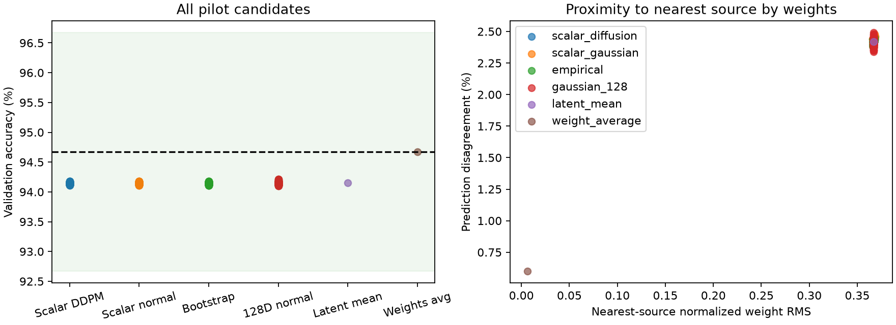
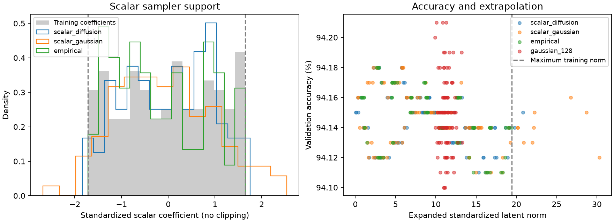

# Phase 8 results: stable scalar generation, no diffusion advantage

Authorized scalar pilot completed October 10, 2026. This is exploratory validation
work after the original official test outcomes were seen. No official test dataset,
held-out branch behavior, source retraining, or decoder training was used. Phase 6's
frozen code, artifact hashes, and negative result remain unchanged.

The two-model architecture now has a scalar DDPM generating one standardized PCA
coefficient, a fixed linear expansion into 128 autoencoder coordinates, and the
existing frozen learned decoder generating 25,818 classifier parameters. The
linear expansion is a transform, not another learned model. The encoder is needed
for preparing training codes but is absent from the standalone generator bundle.
A stochastic second model that samples multiple expansions per coefficient remains
untested; this phase uses the existing deterministic decoder.

The PCA transform and scalar mean/std were fitted on the 160 training codes only.
The first component captures 99.9987508% of training variance. Across 20 validation
checkpoints, both original reconstructions and projected/re-expanded reconstructions
have median accuracy **94.14%**: zero median loss, passing the one-point gate.
Individual reconstruction scores are retained in [the gate CSV](results/08_Projection_Gate.csv).

The scalar DDPM uses width 64, three residual blocks, timestep embedding width 32,
200 noise steps with linear betas 0.0005–0.1, seed 42, Adam 0.001 and batch size 32.
All 2,000 updates completed. Five fixed tuning seeds 60001–60005 were evaluated
every 500 updates. Median accuracies were 94.14%, 94.15%, 94.14%, and 94.14%;
the prescribed rule selected step 1,000. No extra run or hyperparameter search occurred.

Final candidates use fresh seeds 70001–70100 for each stochastic method. Accuracy
is measured on the fixed 10,000-image validation split; selections maximize
validation accuracy, then choose the lowest seed on ties. Training-source median
accuracy is 94.67%. All 400 sampled candidates meet the within-two-points interval.
There were no failed candidates, clipping, range projection, or sample rejection.

| Method | Count | Median accuracy | Worst accuracy | Selected seed | Selected accuracy |
|---|---:|---:|---:|---:|---:|
| Scalar diffusion | 100 | 94.15% | 94.11% | 70007 | 94.18% |
| Scalar Gaussian | 100 | 94.14% | 94.11% | 70056 | 94.18% |
| Training-coefficient bootstrap | 100 | 94.14% | 94.11% | 70002 | 94.18% |
| Original diagonal 128D Gaussian | 100 | 94.15% | 94.10% | 70040 | 94.21% |
| Mean latent | 1 | 94.15% | 94.15% | — | 94.15% |
| Existing weight average | 1 | 94.67% | 94.67% | — | 94.67% |

The recomputed weight-average validation score exactly matches the pre-test saved
baseline. All candidates, including timing and proximity metrics, are in
[the candidate CSV](results/08_Validation_Candidates.csv). Aggregate means, standard
deviations, failures, selections, ranges, timing and memory are in
[the result JSON](results/08_Scalar_Results.json).

Training coefficients range from −1.71910 to 1.64654, and the largest training-code
norm is 19.44931. Scalar diffusion samples range from −1.83915 to 1.75013; three
samples exceed the observed coefficient range and are retained. The expanded norm
maximum is 20.80745, compared with the original sampler's phase 7 maximum 749.69.
The earlier sampler used a different seed set; this is a descriptive comparison,
not a paired experiment or evidence of improved official test performance.

| Method | Coefficient range | Expanded norm range | Nearest training latent RMS range | Mean pairwise prediction disagreement |
|---|---|---|---|---:|
| Scalar diffusion | −1.83915…1.75013 | 0.04531…20.80745 | 0.00191…0.12014 | 0.1714% |
| Scalar Gaussian | −2.68027…2.53857 | 0.34330…30.32361 | 0.00242…0.96118 | 0.1916% |
| Bootstrap | −1.71910…1.64654 | 0.70565…19.44924 | 0.00165…0.00519 | 0.1769% |
| Original 128D Gaussian | −0.23684…0.19307 | 9.90673…13.27096 | 0.87399…1.16835 | 0.1597% |

The 128D Gaussian coefficient column describes its projection onto PC1; these
samples retain all 128 coordinates during decoding. Nearest-latent distances use
all standardized coordinates and only training references. Bootstrap codes retain
a small nonzero distance because PCA discards residual components. These are
reconstructions of sampled training codes, not exact copies of source classifiers.





Scalar diffusion passes the pilot target and removes the extreme extrapolation
seen in the original validation samples, but provides no demonstrated advantage
over simple sampling. Its median exceeds scalar Gaussian and bootstrap by just
0.01 percentage points; their mean accuracies are effectively equal. Predictions
vary on only about 0.17–0.19% of images across scalar candidates. The approximately
0.52-point gap to weight averaging and nearly identical mean-latent performance
suggest investigating the representation/decoder before investing in a more
complicated generator. This is a hypothesis, not a diagnosed cause.

Training plus checkpoint selection took 3.70 seconds. Through final metrics the
run took 15.13 seconds, well below the 30-minute cap; plot rendering and subsequent
verification are outside that reported run time. Peak process RSS was 538.25 MiB.
Scalar diffusion generation averaged 35.83 ms versus 0.61–0.67 ms for the simple
samplers, excluding model-file writes and classifier evaluation. These CPU timings
are observations on this machine, not general benchmarks.

Reproduce from existing local upstream artifacts using a fresh output directory:

```sh
python -m p_diff.train_scalar --output artifacts/scalar-pilot-repeat
python -m p_diff.scalar_generator --bundle artifacts/scalar-pilot/generator.pt --seed 70001 --output artifacts/scalar-classifier.pt
```

The saved bundle is `artifacts/scalar-pilot/generator.pt`; 402 loadable classifiers
are in `artifacts/scalar-pilot/models/`. Binaries remain local and ignored by git.
The standalone generation command was executed from outside the repository without
dataset access and exactly reproduced the evaluated seed-70001 classifier.
Decoder tensors exactly match the original bundle and contain no encoder weights.
All 25 tests pass, including rank-one roundtrips, projection, unbounded extrapolation,
train-only fitting, frozen decoding and deterministic standalone sampling. The
final source adds finite-value and gate-cap checks after the completed run without
changing training or sampling math. See [verification evidence](results/08_Verification.json).

No further model training or official test evaluation is authorized by this phase.
[The next proposed phase](09_Representation_Diagnosis.md) investigates representation
quality on training/validation data before deciding whether a decoder revision is justified.
