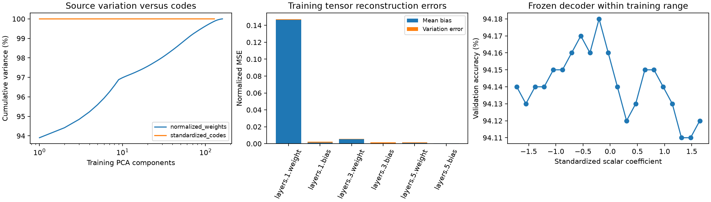

# Phase 9 results: mean reconstruction bias and lost variation

Completed October 10, 2026 under the user's authorization to keep going. This phase
performed no training updates, sampled no new latent candidates, and accessed only
the existing 160 training / 20 validation reconstruction inputs and fixed validation
images. The original official test outcomes have already been seen; this diagnosis
is exploratory and contains no official test or held-out behavior measurements.

The evidence supports trying reconstruction around a fixed training-weight mean
before increasing generator complexity. The current decoder differs from that mean
and preserves little source variation. A fixed mean anchor would remove the need to
learn the shared parameter template; whether a new residual encoder/decoder learns
useful differences remains to be tested under a separate authorization.

Training-only PCA shows a dominant source direction, but the source distribution
has substantially more residual variation than its encoded representation:

| Representation | First component variance | Components for 99% | Components for 99.9% | Participation rank |
|---|---:|---:|---:|---:|
| Normalized source weights | 93.9036% | 61 | 132 | 1.1339 |
| Standardized encoded codes | 99.9988% | 1 | 1 | 1.0000 |

PCA was fitted separately on training rows only. The participation rank emphasizes
that one direction dominates even the source weights; component counts do not imply
that every residual direction matters to classification. Nor does comparing these
spectra prove the encoder's causal contribution: the two representations have
different coordinate scaling, and the encoder/decoder must be examined together.

Every source checkpoint and frozen reconstruction was restored and evaluated on the
same 10,000 validation images. Original accuracies exactly match saved provenance.

| Measurement | Training checkpoints (160) | Validation checkpoints (20) |
|---|---:|---:|
| Median original accuracy | 94.67% | 94.65% |
| Median reconstructed accuracy | 94.14% | 94.14% |
| Reconstructed / source weight variance | 6.3631% | 6.5327% |
| Centered reconstruction error / source variance | 86.4847% | 86.1005% |
| Original pairwise prediction disagreement | 0.6551% | 0.6564% |
| Reconstruction pairwise prediction disagreement | 0.1803% | 0.1878% |
| Mean original-to-reconstruction prediction disagreement | 2.3674% | 2.3720% |

Variance and centered errors are measured across checkpoints in the original
normalized weight coordinates. Group means are diagnostic summaries, not newly
fitted preprocessing for validation data. A small output variance alone would not
prove useful information is retained; centered error directly compares changes in
source and reconstructed weights.

The reconstruction MSE separates exactly into error in the group mean plus error
in centered variation. Equal weighting of the six parameter tensors reproduces
the original autoencoder's balanced loss:

| Balanced normalized MSE | Train | Validation |
|---|---:|---:|
| Mean bias | 0.02576052 | 0.02578125 |
| Centered variation error | 0.00075584 | 0.00072699 |
| Total reconstruction | 0.02651637 | 0.02650825 |
| Constant training-weight mean baseline | 0.00080485 | 0.00078923 |

Mean bias contributes about **97.3% of balanced validation reconstruction error**.
The learned reconstruction's validation MSE is about **33.6 times** the constant
training-mean baseline. Its largest error is the first-layer weight tensor:
validation MSE 0.14740508, of which 0.14659277 is mean bias. Parameter-count-weighted
MSE also appears in the evidence, but must not be confused with the balanced training
objective. The bias is the difference between parameter-vector averages; it is not
an assertion about the classifier's bias tensors alone.

The existing averaged-weight classifier still scores 94.67% validation accuracy.
It is already a better deterministic baseline than the current learned decoder.
These observations measure reconstruction quality, not the quality of a future
residual generator.

Decoder sensitivity was measured at exactly 21 equally spaced scalar coefficients
between the observed training limits −1.7190974 and 1.6465393, plus coefficient zero.
The grid was written before evaluating any source or probe behavior. No clipping,
range extension, selection, or sampler tuning was performed. Across these 22 probes:

- Validation accuracy ranges from 94.11% to 94.18%, a 0.07-point span.
- Mean pairwise prediction disagreement is 0.1872%.
- Endpoint normalized weight RMS difference is 0.02636294.
- Across-probe normalized output variance is 0.0000608167.

The decoder responds to its scalar input, but within the observed range its
classifiers remain close in behavior and below weight averaging. A stochastic
expansion model could introduce additional variation; these results do not establish
that such variation would help. Correcting the shared template and testing residual
reconstruction has a clearer measurable target first.



Evidence: [PCA spectra](results/09_PCA.csv), [all checkpoint metrics](results/09_Checkpoints.csv),
[per-tensor errors](results/09_Tensor_Errors.csv), [all probes](results/09_Probes.csv),
[aggregate results](results/09_Results.json), and [the predeclared run](results/09_Run.json).

Reproduce with existing local artifacts and a fresh output directory:

```sh
python -m p_diff.diagnose_representation --output artifacts/representation-diagnosis-repeat
```

The final diagnosis took 4.42 seconds through metrics, with peak RSS 738.30 MiB.
It was run once initially and repeated with the same inputs and fixed probes to add
equal-tensor-weighted loss summaries; combined measurement time was 8.81 seconds.
Plot rendering and subsequent verification are outside those reported run times.
All 27 tests pass, including mean/variation error decomposition and unordered-pair
prediction disagreement. Exported codes were recomputed with the frozen encoder and
matched exactly; decoder tensors match the original autoencoder. Every input hash
was unchanged after the run, and the original frozen protocol remains valid.

Phase 9 is complete. [The proposed residual reconstruction pilot](10_Residual_Reconstruction_Pilot.md)
requires separate approval; no residual model has been trained or implemented yet.
