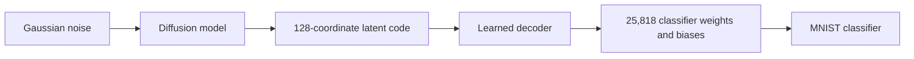

# Architecture notes: generating compact codes and expanding them

User question, October 10, 2026: would two models make sense, one generating compressed
parameters and another estimating their expanded version?

Yes. That is the current generation architecture:

During training, an encoder maps source parameter vectors into latent codes. The
encoder and decoder are trained together for reconstruction. After freezing them,
diffusion learns the distribution of training codes. At generation, the encoder is
unnecessary: diffusion synthesizes a code and the decoder expands it. Normalization
is reversed at the latent and parameter boundaries. The resulting classifier predicts
without gradient updates.

The decoder is a second learned model, not a fixed lossless decompressor. Because
compression discards information, it estimates weights learned from source examples;
an arbitrary compressed code need not expand into a good classifier. The two stages
have separate responsibilities: generating plausible codes and preserving useful
classifier behavior when decoding them.

The current decoder is deterministic: the same latent always yields the same weights.
If the proposal means a second *stochastic* model producing different expansions
from the same code, that is a different conditional generation experiment. It could
represent uncertainty in discarded details, but would need training evidence that
those different expansions retain accuracy. It would add capacity and sampling cost,
and the current 160 correlated source snapshots provide limited evidence for learning
such conditional variation. No stochastic decoder experiment has been run.

The measured problem currently occurs at the compact-code interface: one training
principal component explains 99.9988% of standardized latent variance, while diffusion
often produces codes far beyond the training range. The decoder's earlier reconstruction
tests also showed reduced weight variation. Both are limitations; the diagnostic
correlations do not isolate a cause.

A concrete next experiment retains the two learned stages but makes the generator's
job smaller: generate a standardized scalar PCA coefficient, expand it through a
training-fitted linear PCA map to the existing 128-coordinate code, then use the frozen
learned decoder to produce weights. PCA would be a deterministic adapter, not a new
learned stochastic expander. First verify that this extra compression preserves
validation reconstruction behavior. See [the proposed experiment](08_Reduced_Latent_Pilot.md).

If reconstruction itself fails in future work, a separately authorized decoder study
could consider larger latents or a classifier-behavior loss using training images.
Validation would choose settings; official test images would not train the decoder.
